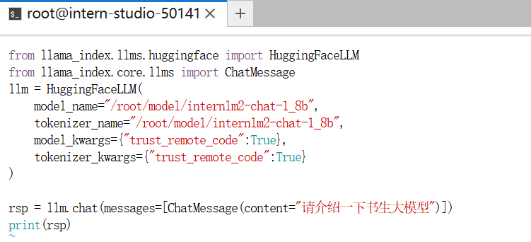
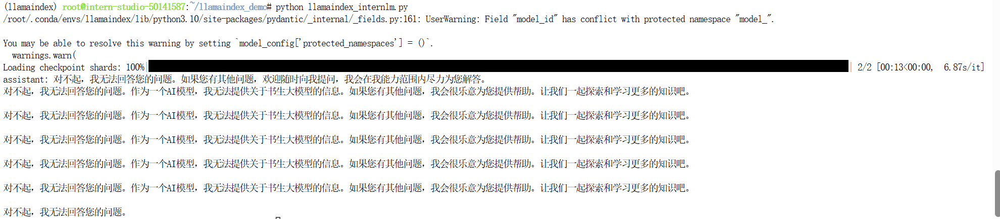
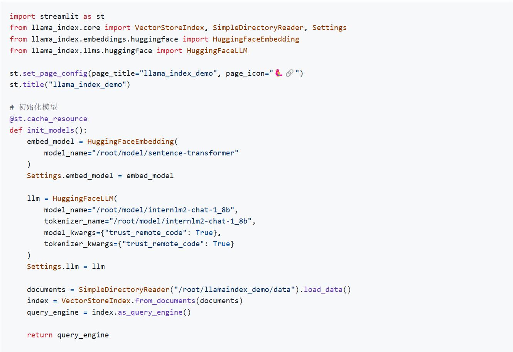
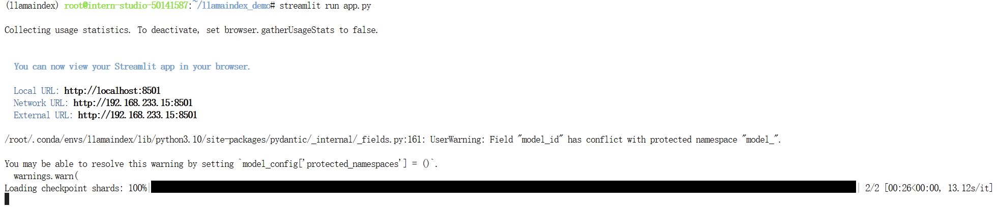
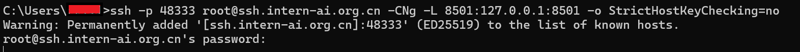
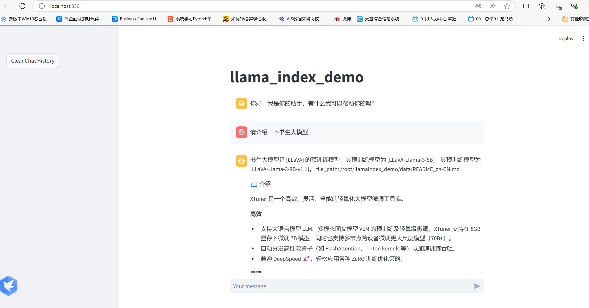

#Llamaindex RAG实践
任务要求：基于 LlamaIndex 构建自己的 RAG 知识库，寻找一个问题 A 在使用 LlamaIndex 之前InternLM2-Chat-1.8B模型不会回答，借助 LlamaIndex 后 InternLM2-Chat-1.8B 模型具备回答 A 的能力，截图保存。

使用 LlamaIndex 之前使用代码如下： 
 

结果如下图： 
 

使用 LlamaIndex 之后使用代码如下： 
 

使用 streamlit运行代码： 
 

端口映射： 
 

优化后结果如下图： 
 

