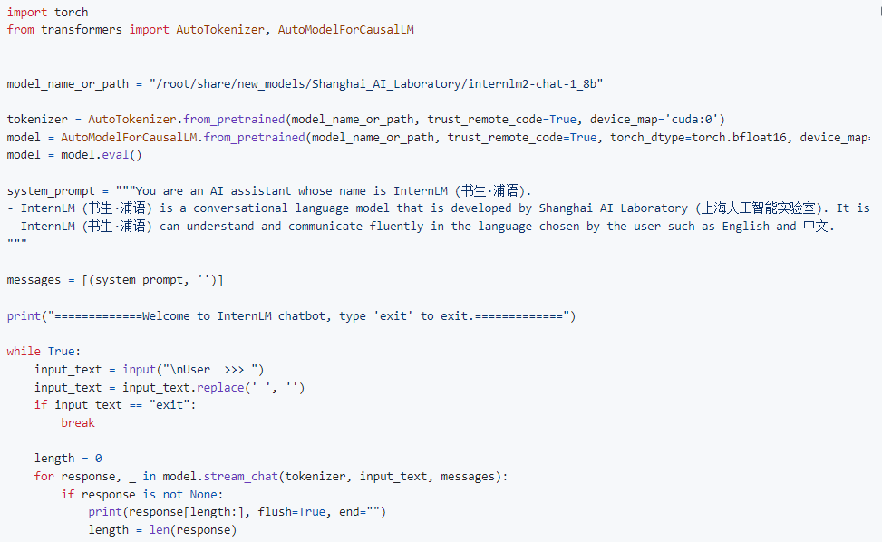
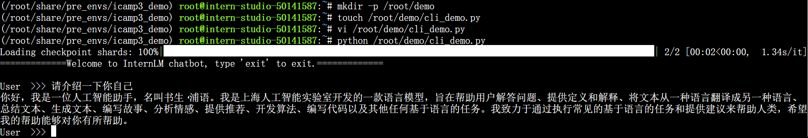
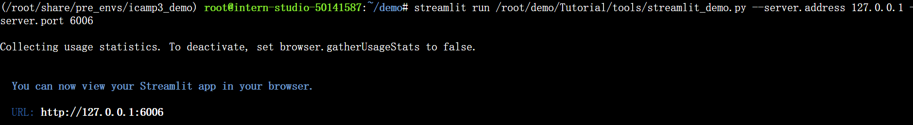
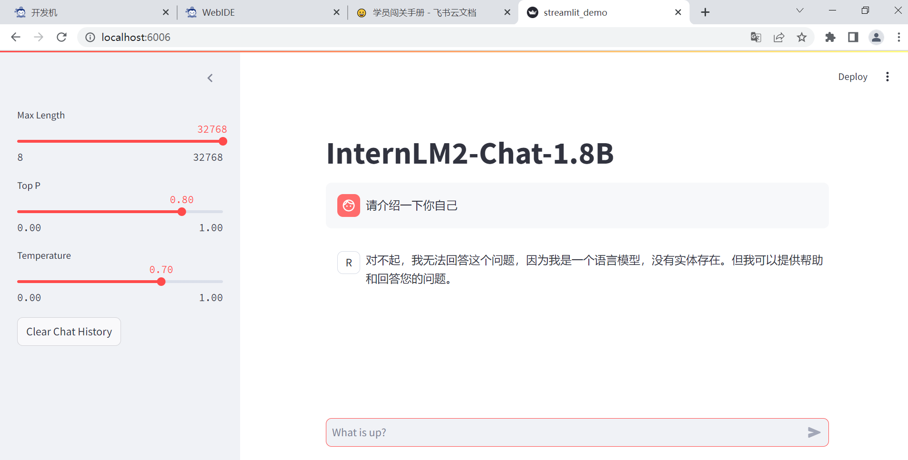
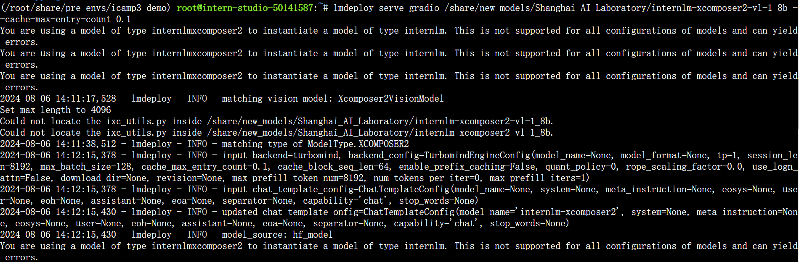
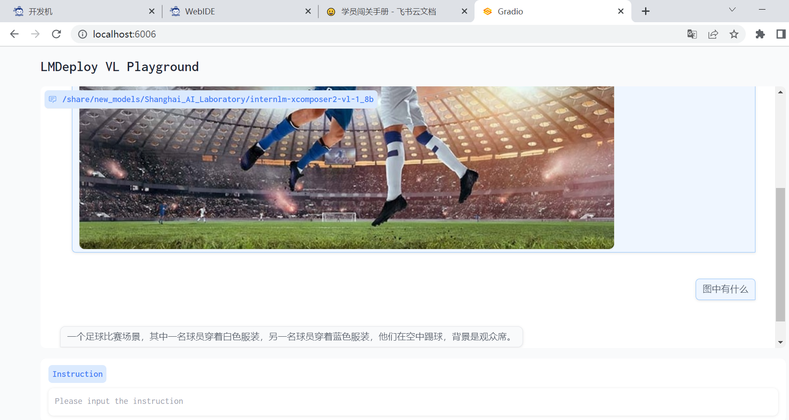
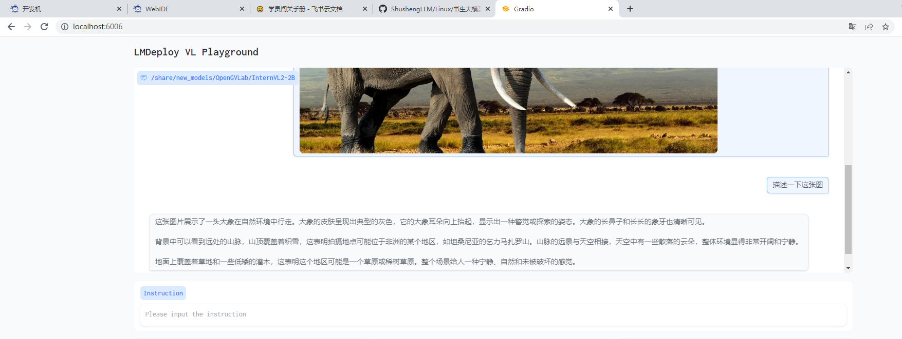

#书生大模型闯关任务-8G显存玩转书生大模型demo

本关任务主要包括：

1.InternLM2-Chat-1.8B 模型的部署（基础任务）
2.InternLM-XComposer2-VL-1.8B 模型的部署（进阶任务）
3.InternVL2-2B 模型的部署（进阶任务）

1.InternLM2-Chat-1.8B 模型的部署
demo代码如下图： 
 
启动demo，用户在命令行输入问题后效果如下所示： 
 

使用 Streamlit 部署 InternLM2-Chat-1.8B 模型， 
启动一个 Streamlit 服务： 
 
在本地成功运行端口映射后如下所示： 
 
最终在网页中成功打开web ui后效果如下： 

2.InternLM-XComposer2-VL-1.8B 模型的部署
使用 LMDeploy 启动一个与 InternLM-XComposer2-VL-1.8B 模型交互的 Gradio 服务： 
 
最终在网页中成功打开web ui后upload如下图片： 
 
效果如下： 
 

3.InternVL2-2B 模型的部署
使用 LMDeploy 启动一个与 InternVL2-2B 模型交互的 Gradio 服务， 
最终在网页中成功打开web ui后upload如下图片： 
 
效果如下： 
 

