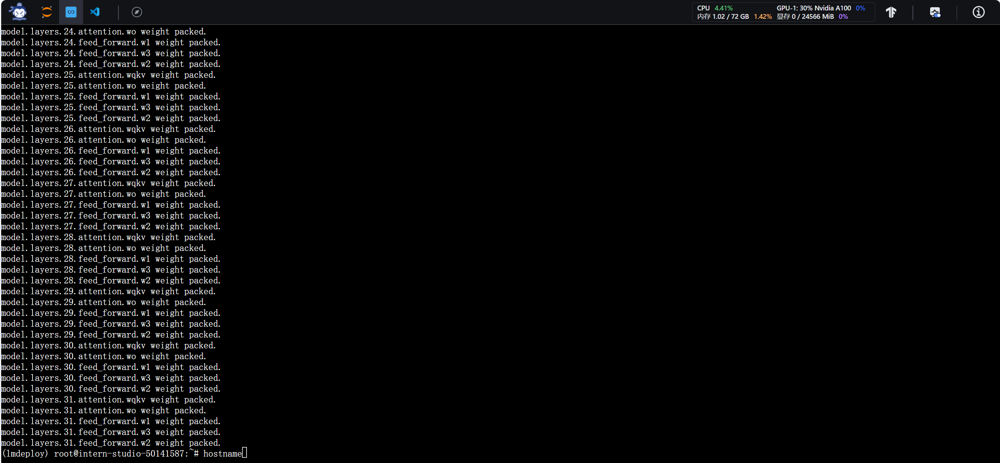

#LMDeploy 量化部署实践闯关任务
1.使用结合W4A16量化与kv cache量化的internlm2_5-7b-chat模型封装本地API并与大模型进行一次对话，作业截图需包括显存占用情况与大模型回复

2.使用Function call功能让大模型完成一次简单的"加"与"乘"函数调用，作业截图需包括大模型回复的工具调用情况

量化压缩过程如下： 
 
压缩前后的文件大小对比如下： 
 

任务1.
调用结合W4A16量化与kv cache量化的internlm2_5-7b-chat模型： 
 

本地API与大模型进行一次对话，效果如下： 
 

任务2.
调用工具并使用Function call功能： 
 

大模型回复的效果如下： 
 

