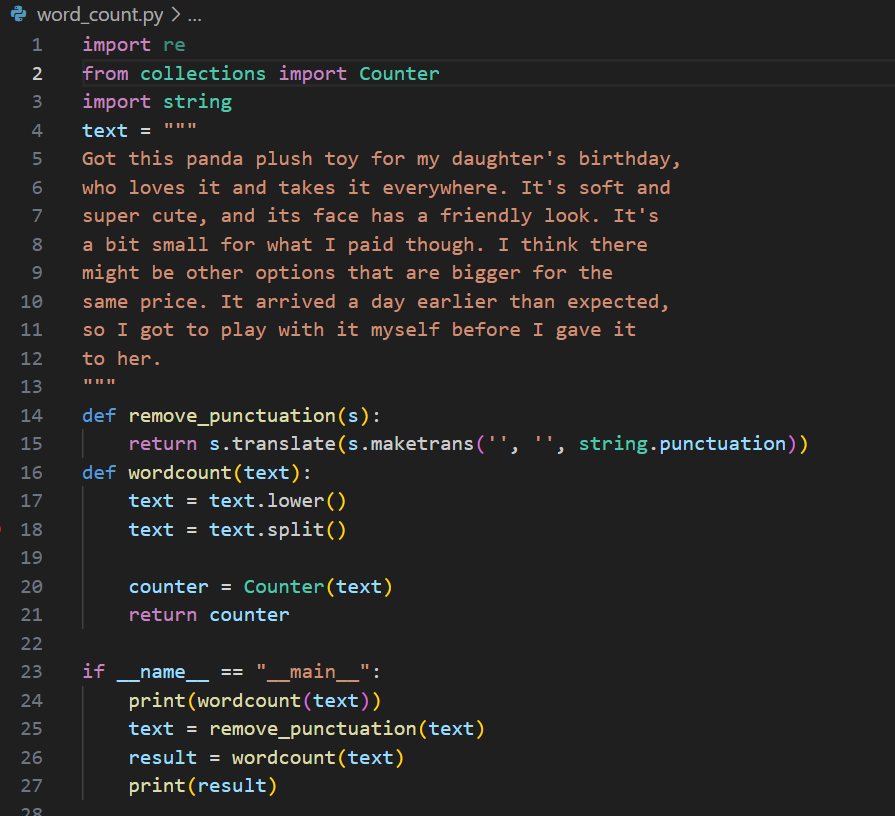
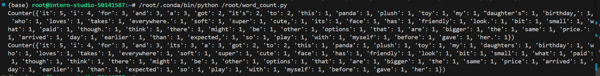
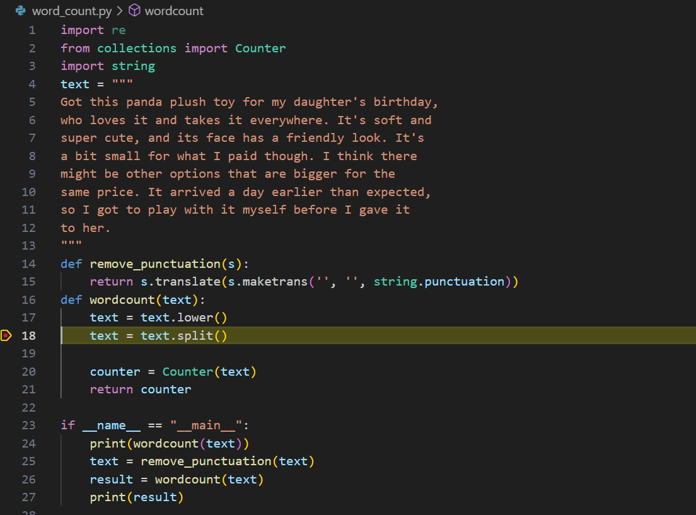

#书生大模型闯关任务-Python基础知识

这个任务是完成word_count 和 用vscode debug:

1.word_count 程序编写：

请实现一个wordcount函数，统计英文字符串中每个单词出现的次数。返回一个字典，key为单词，value为对应单词出现的次数。记得先去掉标点符号,然后把每个单词转换成小写。不需要考虑特别多的标点符号，只需要考虑实例输入中存在的就可以。

word_count.py 程序如下：，如下图： 
 
运行结果如下所示： 
 

2.debug
debug流程如下：
VScode进行SSH远程连接后安装Python和Python Debugger插件
代码框上加红色断点，在vscode 页面左侧点击 Run and Debug 按钮，即可进入debug模式：
 

