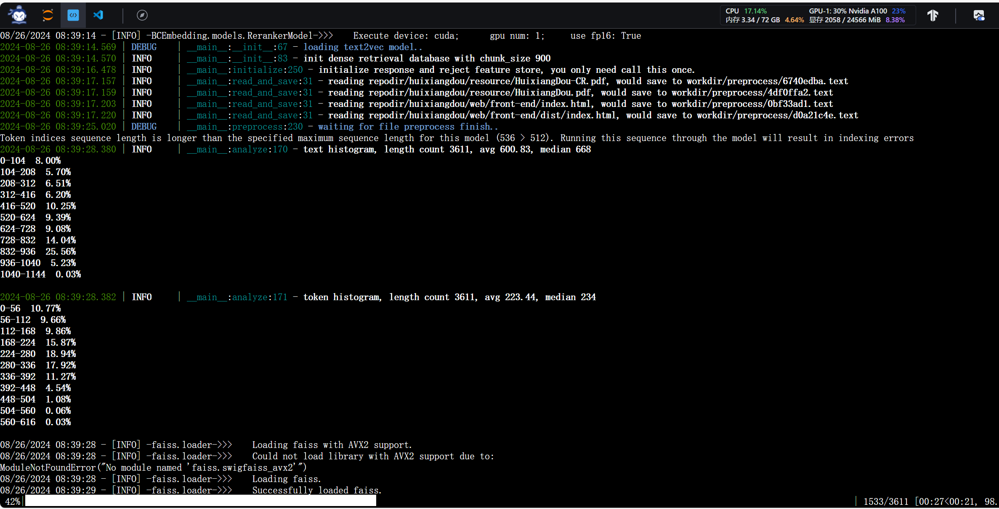
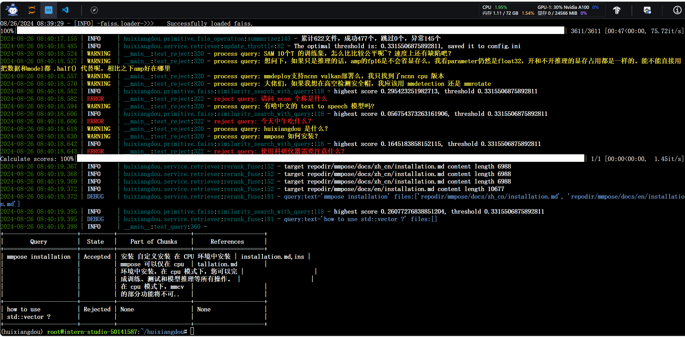
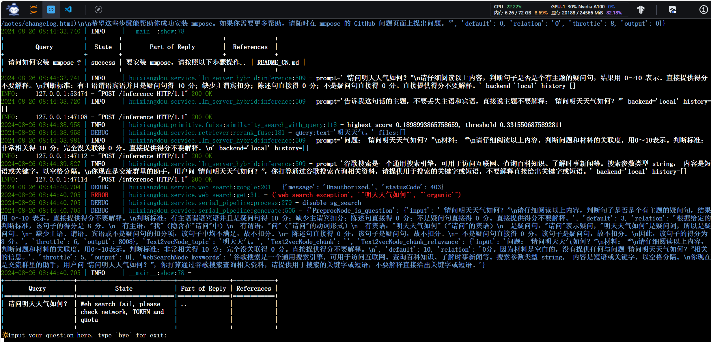
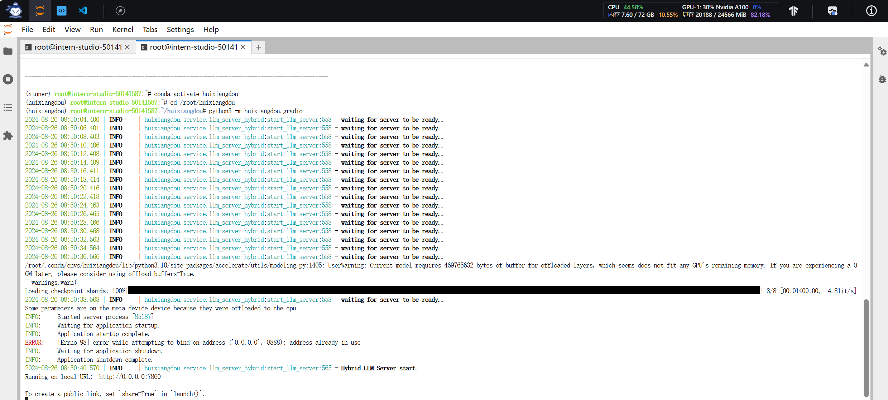
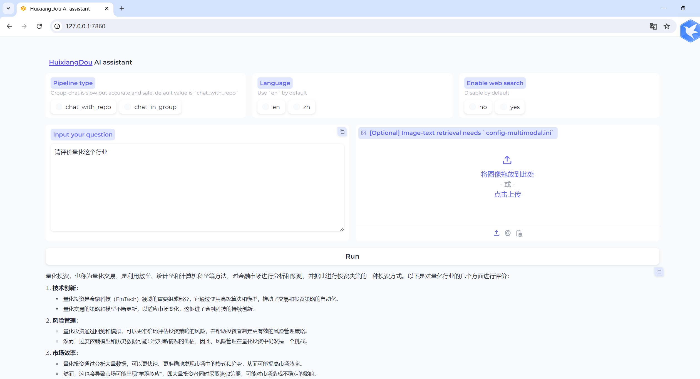
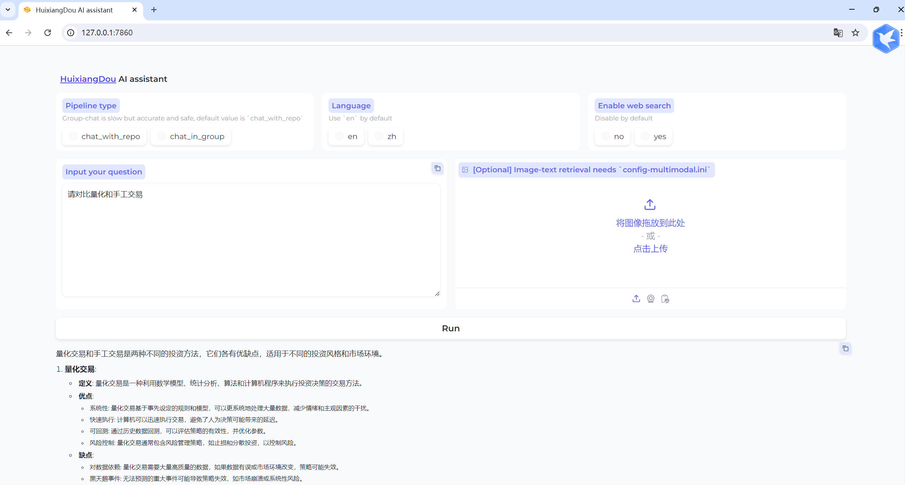

#茴香豆：企业级知识问答工具实践
在 InternStudio 中利用 Internlm2-7b 搭建标准版茴香豆知识助手，并使用 Gradio 界面完成 2 轮问答。

利用茴香豆搭建一个茴香豆和 MMPose 的知识问答助手： 
 

 

用命令行对现有知识库问答助手进行测试： 
 

启动茴香豆 Web UI：： 
 

在本地机器命令行中运行如下命令： 
 

问答效果如下：

 

 

